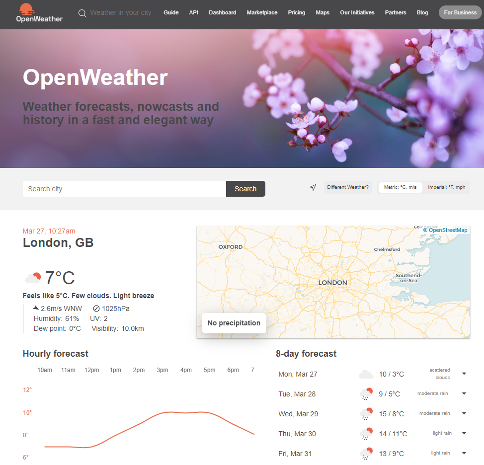
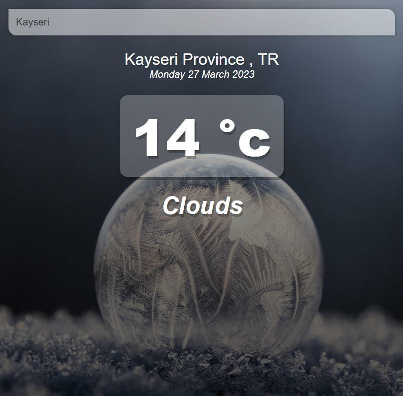
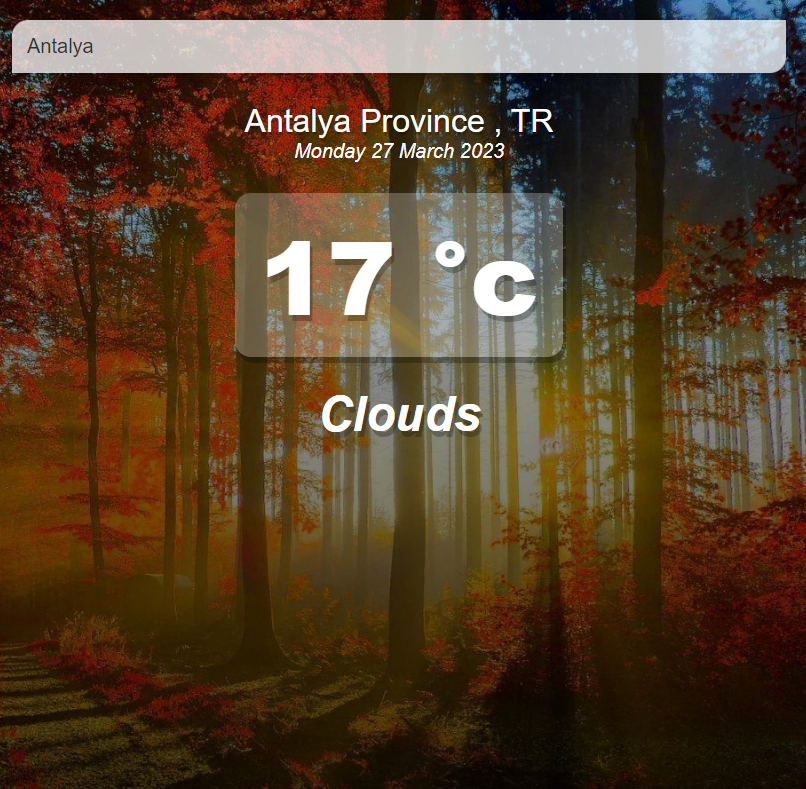

# Vue.JS Hava Durumu Uygulaması

API kullanımı için https://openweathermap.org linkinden faydalanılmıştır.

Arama çubuğuna Şehir ismi yazıldıktan sonra Enter tuşuna basıldığı zaman arama yapmaktadır.

16°C altında zaman aşağıdaki şekilde görünüm vardır.

16°C üstündeki durumlarda aşağıdaki şekilde arka plan resmi değişmektedir..

